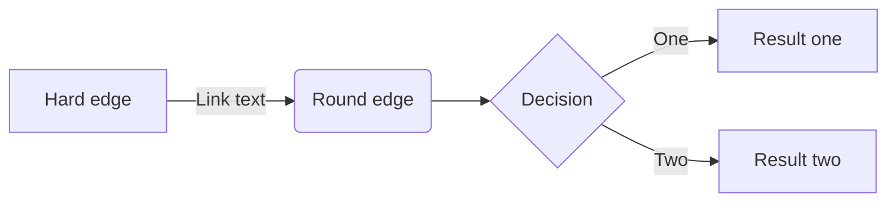

# 研究生数学建模竞赛2018年“恐怖主义量化分析”

| 编号 | 语言 | 软件 | 关键词 | 关键词 | 关键词 | 关键词| 关键词 |
| :----: | :----: | :----: | :----: | :----: | :----: | :----: | :----: |
| C18101830161 | C++(**) |  | 改进k-means | 主成分分析 | 逻辑回归 |灰色预测||
| C18103570006 | Matlab(**) | ArcGIS(For Mapping) | 模糊C均值(FCM)    | 模糊K-means          |     Fuzzy-C     |        距离测度         |            |
| C18102720070 | python(**) |  | 主客观集成赋权 | OPTICS聚类 | XGBoost集成学习 |lightgbm-Multi logistic|ARMA模型|
| C18105320019 | Python(***) |  | 遗传模拟退火 | SVM | 贝叶斯网络 |FCM聚类||
| C18108560226 | R语言(*) | SPSS | 因子分析 | CRITIC赋权 | person相关系数 |IPSO-SVM||
| C18900450036 | Matlab(**_) |                     | 信息完备性        | IS3VM(改进半监督SVM) |   类平均算法    |RBF时间序列模型|离群点检测|
| C18910040046 | \ |  | DEA(数据包络分析) | DBSCAN聚类分析 | 灰度关联度分析 |||

